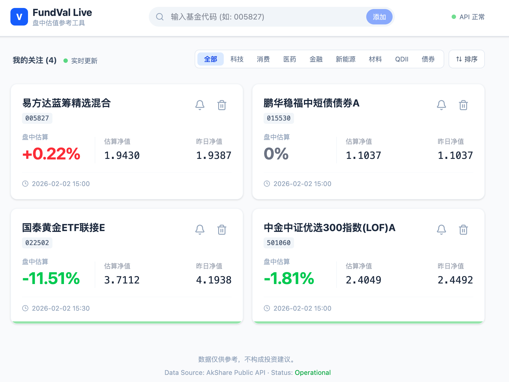
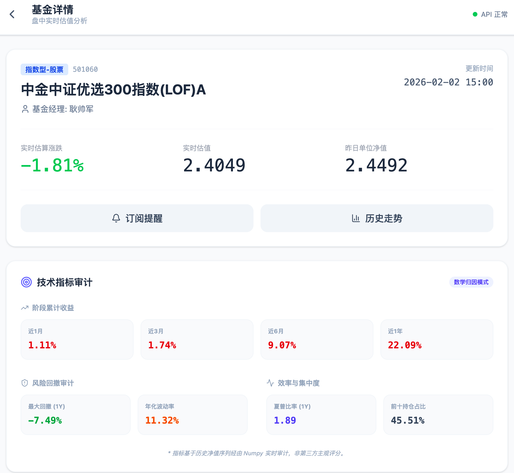
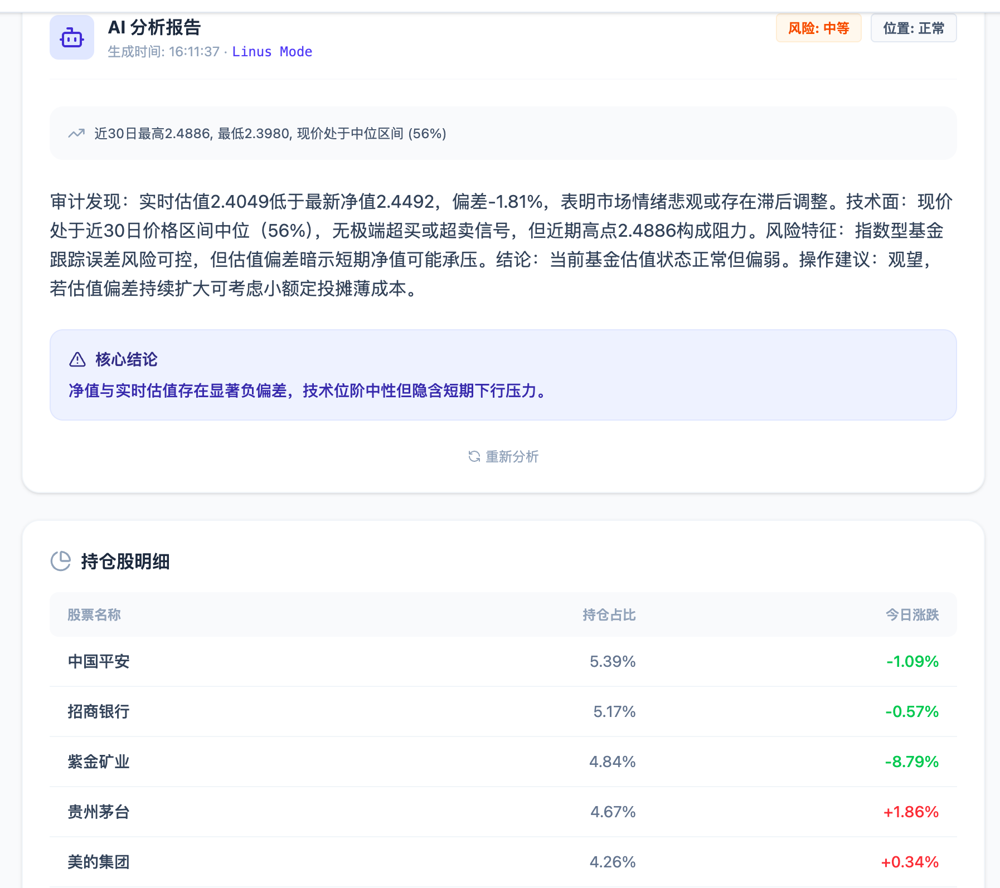

# FundVal Live - 盘中基金估值与审计系统

这是一个面向专业投资者的基金实时估值与逻辑审计工具。系统通过多源数据交叉验证与硬核数学模型，剔除市场噪音，还原基金运行的真实逻辑。

## 核心理念

- **拒绝黑箱**：估值基于透明的持仓权重与实时行情加权计算，不依赖单一滞后的第三方接口。
- **数据审计**：自动清洗持仓数据，剔除重复项与零权重噪音，确保分析基座的纯净。
- **多源容灾**：自动在天天基金、新浪财经等多个数据源间无缝切换，确保 QDII 及新成立基金的估值可用性。
- **数学归因**：用夏普比率、最大回撤、年化波动率等硬指标替代主观的评分体系。

## 功能特性

### 1. 全球市场盘中估值
系统支持 A 股、港股、美股市场的实时行情抓取。针对 QDII 基金（如标普500、纳指、全球精选等），系统具备自动识别代码格式并调用对应交易所数据的能力，解决了传统工具对海外持仓穿透力不足的问题。

### 2. Linus 风格逻辑审计 (AI Audit)
内置深度审计引擎。AI 不再复述无用的新闻舆情，而是基于数学事实（估值偏差、技术位阶、回撤特征）进行逻辑审计，直接指出市场定价的非理性之处，并给出“持有”、“止盈”或“定投”的明确指令。

### 3. 硬核技术指标
基于过去 250 个交易日的净值序列，利用 Numpy 进行实时向量化计算：
- **夏普比率 (Sharpe Ratio)**：衡量风险调整后的收益效率。
- **最大回撤 (Max Drawdown)**：客观审计历史极端风险。
- **年化波动率 (Volatility)**：通过数学方差衡量持仓稳定性。

### 4. 易用性工具
- **智能筛选**：支持按科技、消费、医疗、QDII、债券等板块一键过滤。
- **涨跌排序**：实时按盘中估算涨跌幅进行动态排序。
- **一键启停**：内置自动化脚本，处理环境检查、依赖安装及后台持续运行。

## 预览

### 资金看板


### 技术指标审计


### 深度逻辑报告


## 技术架构

- **后端**：Python (FastAPI)
  - 数据源：AkShare, Eastmoney, Sina Finance, Baidu Finance
  - 计算引擎：Numpy (金融审计计算)
  - 存储：SQLite (基础信息缓存)
- **前端**：React (Vite)
  - UI组件：Tailwind CSS, Lucide Icons
  - 图表：Recharts (实时走势渲染)

## 快速开始

### 环境要求
- Python 3.13+
- Node.js 18+
- uv (Python 包管理工具)

### 1. 配置
在项目根目录创建 `.env` 文件：

```ini
# AI 分析配置 (OpenAI / DeepSeek)
OPENAI_API_KEY=sk-xxxxxxxx
OPENAI_API_BASE=https://api.openai.com/v1
AI_MODEL_NAME=deepseek-chat
```

### 2. 启动与停止

系统提供了全自动化的脚本处理后台运行与日志记录：

```bash
# 启动前后端服务（含依赖自动安装、后台运行、日志重定向）
./start.sh

# 查看实时运行日志
tail -f logs/backend.log

# 停止所有服务
./stop.sh
```

## 免责声明

本项目提供的数据与分析仅供技术研究使用，不构成任何投资建议。市场有风险，代码无绝对，交易需谨慎。
